# TaskFlow

A small, self-hosted task manager built around three queues per project — **To do**,
**Ongoing** and **Done** — with the calendar days you actually worked on each task
recorded day by day. Finished tasks lock themselves, so a task you closed stays
closed until you deliberately unlock it.

No accounts, no sign-in, no external services. One command and it runs.

```
┌─────────────┐        ┌───────────────────────┐        ┌───────────────┐
│  React SPA  │  HTTP  │  Go + chi + sqlc      │  SQL   │  MySQL 8.4    │
│  (built)    │ ─────► │  also serves the SPA  │ ─────► │  (volume)     │
└─────────────┘        └───────────────────────┘        └───────────────┘
```

<p align="center">
  
</p>

<p align="center"><sub>A higher quality recording is in <a href="docs/walkthrough.webm">docs/walkthrough.webm</a>.</sub></p>

---

## Contents

- [Quick start](#quick-start)
- [Walkthrough](#walkthrough)
  - [1. Projects](#1-projects)
  - [2. The board](#2-the-board)
  - [3. Moving work between queues](#3-moving-work-between-queues)
  - [4. The task drawer](#4-the-task-drawer)
  - [5. Logging the days you worked](#5-logging-the-days-you-worked)
  - [6. Finishing and locking a task](#6-finishing-and-locking-a-task)
  - [7. The calendar](#7-the-calendar)
  - [8. The task list](#8-the-task-list)
  - [9. Exporting](#9-exporting)
  - [10. Dark mode](#10-dark-mode)
- [Concepts](#concepts)
- [Keyboard shortcuts](#keyboard-shortcuts)
- [Configuration](#configuration)
- [API](#api)
- [Architecture](#architecture)
- [Development](#development)
- [Testing](#testing)
- [Security](#security)

---

## Quick start

Requirements: Docker with Compose v2. Nothing else — Go and Node are only needed
if you want to develop.

```bash
git clone <this repo> taskflow
cd taskflow

cp .env.example .env        # optional: change the port and the passwords
docker compose up -d --build
```

Open <http://localhost:8080>.

The database schema is created automatically on first boot, so there is no
migration step to run. On a clean install there is one thing to do:

<p align="center">
  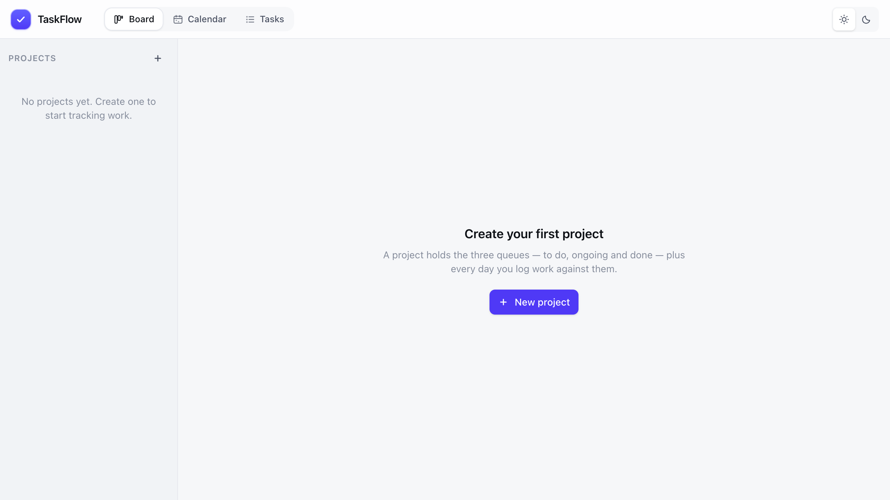
</p>

Want data to look at first?

```bash
./scripts/seed.sh http://localhost:8080     # three sample projects with real history
```

### Everyday commands

| Command | What it does |
| --- | --- |
| `docker compose up -d --build` | Build if needed, then start everything |
| `docker compose logs -f app` | Tail the application log |
| `docker compose restart app` | Restart just the app (the database keeps running) |
| `docker compose down` | Stop everything, **keeping** your data |
| `docker compose down -v` | Stop and **delete** the database volume |
| `make help` | The same list, plus the development helpers |

Your data lives in the `taskflow_mysql-data` Docker volume. `docker compose down`
leaves it alone; only `down -v` destroys it.

---

## Walkthrough

### 1. Projects

Everything lives inside a project. Create one with the **+** next to *Projects* in
the sidebar, give it a name, an optional description and a colour, then start
adding tasks.

- Click a project in the sidebar to open its board.
- Drag a project by the handle on its left to reorder it; the order is saved.
- The **⋯** menu on a project renames it, archives it, or deletes it along with
  all of its tasks.

The number beside each project is how many of its tasks are still open.

### 2. The board

Each project has three columns. This is the main working view.

<p align="center">
  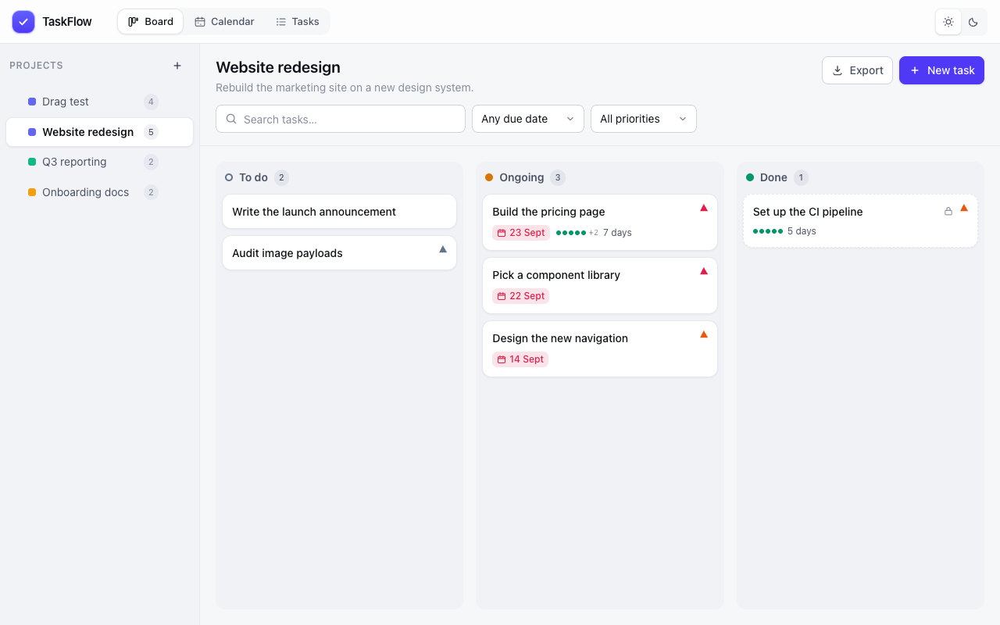
</p>

| Column | What it is for |
| --- | --- |
| **To do** | Work you have not started. Reorder, edit, delete, and set a start date. |
| **Ongoing** | Work in progress. Everything from *To do*, plus the days you worked on it. |
| **Done** | Finished work. Read-only until you unlock it. |

Each card shows its title, a coloured flag for priority, the due date (red once
it is overdue) and a row of dots for the days you have logged. A card in **Done**
is drawn with a dashed border and a padlock, because it cannot be edited.

The filters above the board are **search**, **due date** and **priority**. There
is deliberately no project or status filter here: the sidebar already chooses the
project, and the columns already are the status.

### 3. Moving work between queues

Drag a card anywhere on it — you do not need to find a handle.

- **Within a column** to reorder. Release on the top half of a card to place your
  card above it, on the bottom half to place it below.
- **Onto another column** to change queue.

Dropping a card into **Done** asks whether to finish *and lock* it, rather than
silently locking work you may still want to change.

<p align="center">
  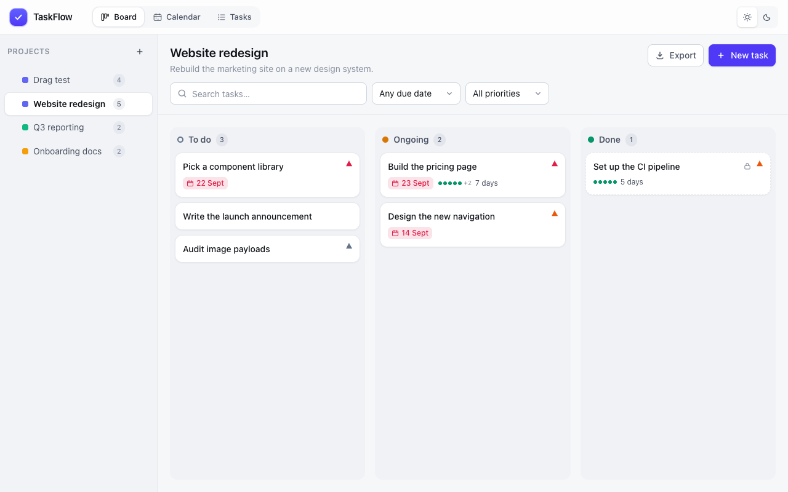
</p>

Only the card you moved is written to the database: the client sends the two
neighbours it should land between and the server works out a position between
them, so a drag never renumbers a whole column.

### 4. The task drawer

Click a card to open it. The drawer holds everything about one task.

- **Title** and **description** — the description is a free-form notes field.
- **Priority** — `Low`, `Normal`, `High` or `Urgent`, shown as a coloured flag.
- **Due date** — optional; turns red once it is overdue.
- **Queue** — move between the three columns from inside the drawer.
- **Days worked** — the calendar described next.
- **Delete** — at the bottom.

Title, description, priority and due date save when you click away from a field,
so there is no save button to forget. *Save changes* is there if you prefer to
be explicit.

<p align="center">
  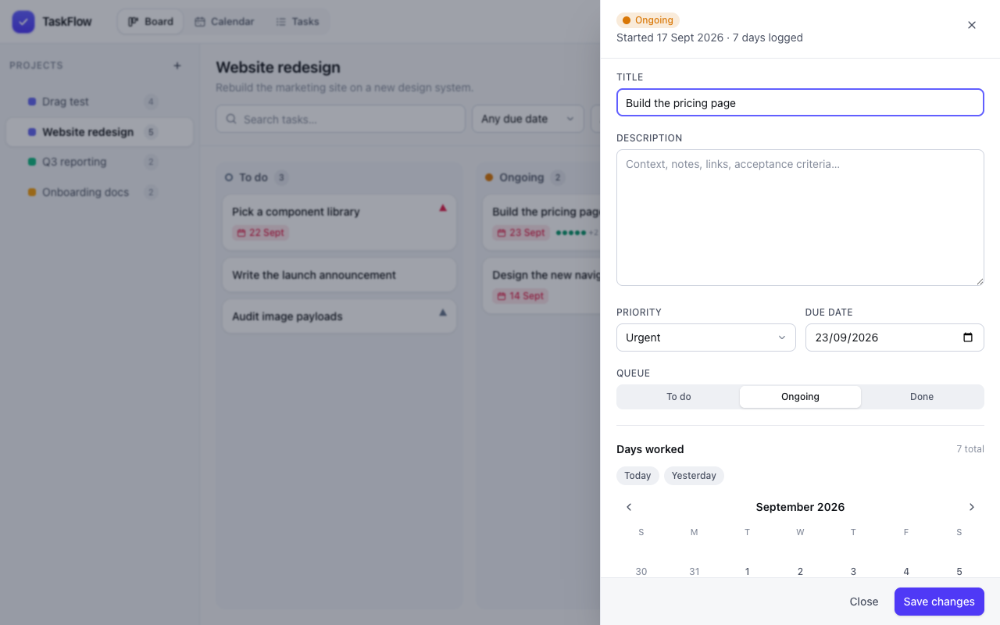
</p>

### 5. Logging the days you worked

A task only accepts work days once it is **Ongoing**. Start it by setting a start
date (from the drawer's *Queue* control, or by dragging it to *Ongoing*).

Then, in **Days worked**:

- Click **Today** or **Yesterday** for the common cases.
- Or click any day in the month grid. Clicking a marked day again removes it.
- Use the arrows to page through months.

<p align="center">
  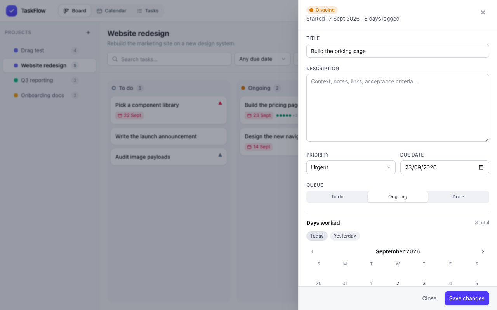
</p>

The same days drive the board card's dots and the calendar, so the record of your
work lives in one place.

### 6. Finishing and locking a task

Move a task to **Done** and confirm. That sets its completion time and locks it.

While a task is locked, **every** change is refused — the fields are disabled and
the API answers `423 Locked` even if something tries to bypass the UI. This is the
point of the feature: a finished task cannot be quietly rewritten.

<p align="center">
  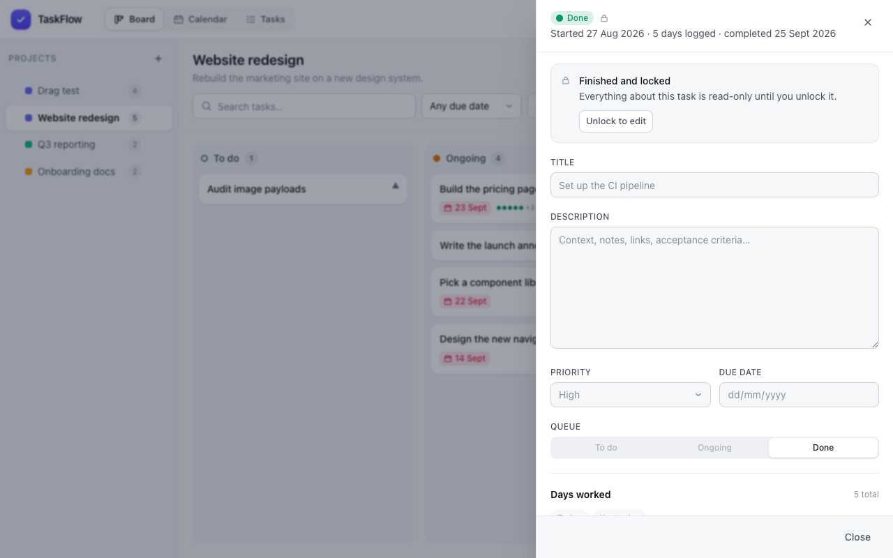
</p>

If something really does need to change, press **Unlock to edit**. You can then
correct anything, and press **Lock again** to return it to its finished state.
Moving it back to *Ongoing* or *To do* also unlocks it.

### 7. The calendar

The calendar spans **every project and every queue at once**, because the board's
sidebar and columns already provide that scoping. It has two views.

<p align="center">
  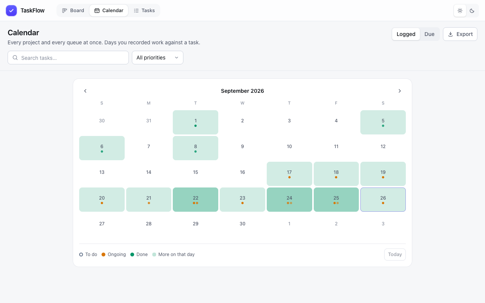
</p>

**Logged** — every day you recorded work, shaded by how much. Each cell stacks up
to five dots coloured by the status of the tasks worked that day: **done** green,
**ongoing** amber, **to do** hollow. Urgent work is drawn opaque and low priority
is faded, so the dots read in priority order, and `+N` means there were more.

<p align="center">
  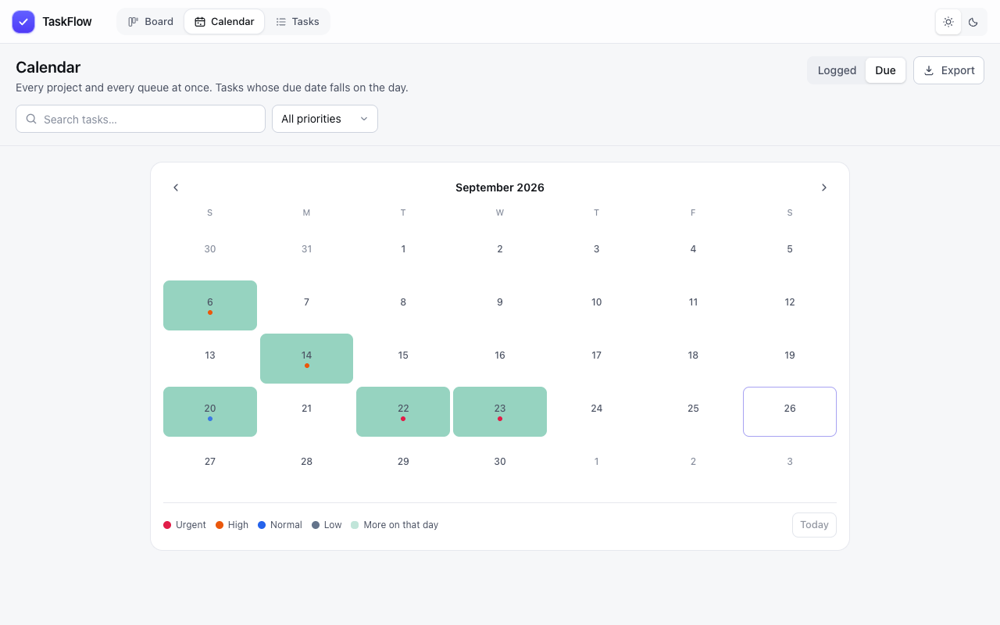
</p>

**Due** — the same grid showing tasks by their due date instead, with the dots
coloured by priority.

Click any day to open a drawer listing every task for that day, with its project,
priority and status. The grid and the drawer come from a single request, so it
opens instantly.

The only filter here is **search** plus **priority**.

<p align="center">
  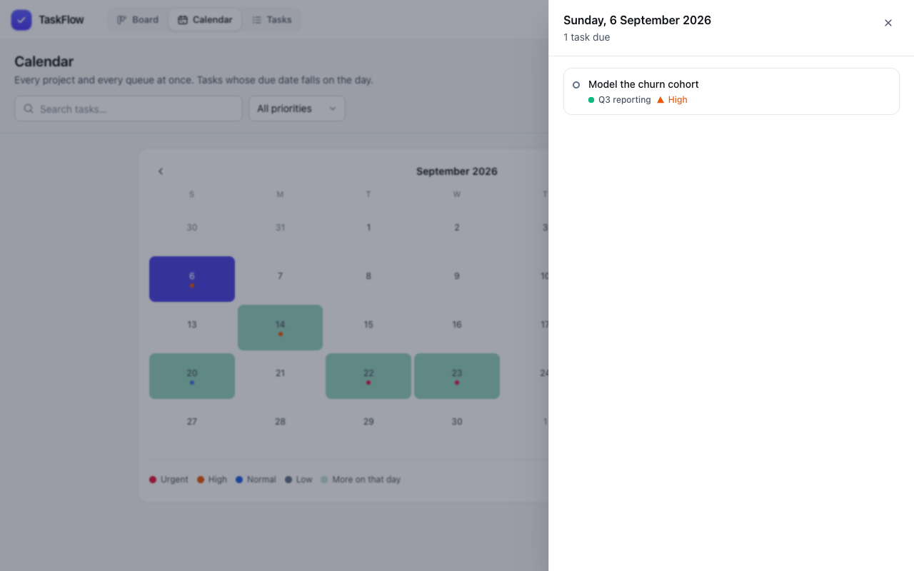
</p>

### 8. The task list

A single dense table of every task across every project — the view to use when you
want to see everything at once, or everything about one project.

<p align="center">
  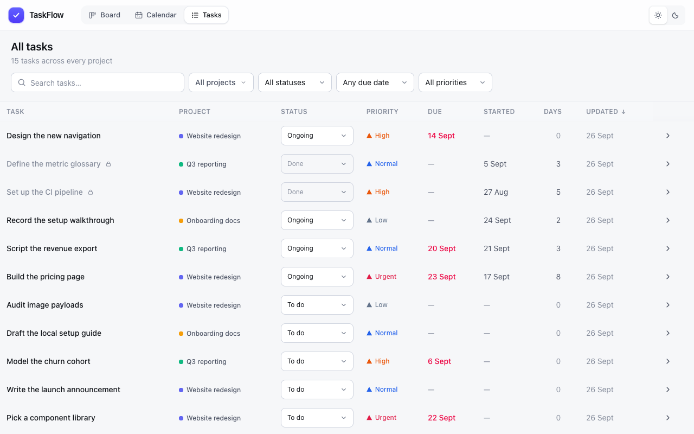
</p>

- Click any column header to sort by it.
- Change a task's status or priority inline.
- Click a row to open the same drawer as the board.
- Click a project name to jump to that project's board.

This is the only page with **project**, **status**, **due date**, **priority** and
**search** filters, because it is the only one that spans them all.

### 9. Exporting

**Export** is available on the board and the calendar.

<p align="center">
  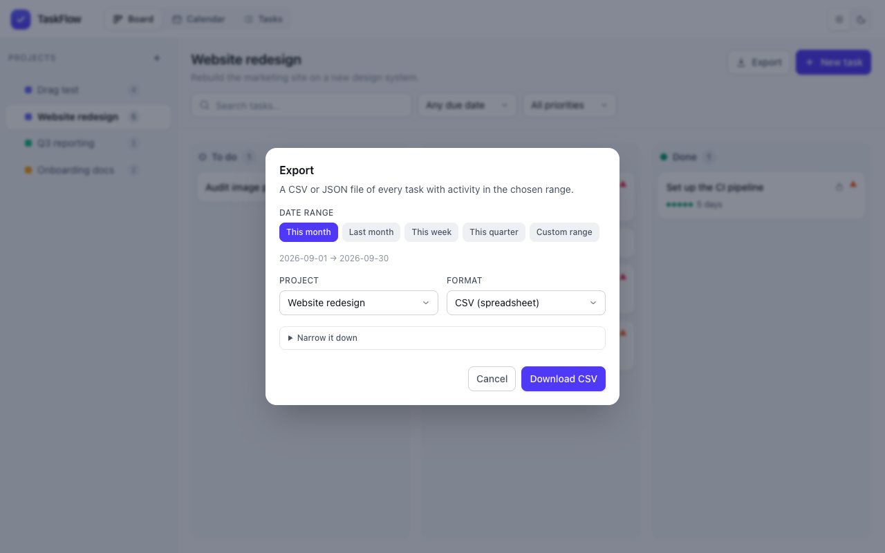
</p>

- **Date range** — this month, last month, this week, this quarter, or a custom
  from/to pair. A month is just the default range, so a monthly export needs no
  extra work.
- **Project** — one project, or all of them. On the board the current project is
  pre-selected.
- **Format** — CSV for a spreadsheet, or JSON.
- **Narrow it down** — optionally restrict to a status or a priority.

A task is included if any of it falls inside the window: work logged in the range,
a due date in the range, a start date in the range, or a completion in the range.
Each row carries its days worked in the range and its full work-day list.

### 10. Dark mode

The sun and moon in the header switch themes. Your choice is remembered.

<p align="center">
  
</p>

Both themes are defined by a single set of colour roles in
`frontend/src/index.css`, so the two stay in step.

---

## Concepts

**A task is in exactly one of three states.** `todo` → `ongoing` → `done`. Moving
backwards is allowed; nothing is deleted when a task moves.

**Starting is explicit.** A task does not become *Ongoing* by being edited. You
give it a start date, which is also recorded, so you can see when work actually
began as well as when it was due.

**Work days are per task.** Any number of days can be attached to one task, and
the same day can carry work on several tasks. This is what makes the calendar
useful: it is a record of what you did, not a list of deadlines.

**Done means locked.** Completion and locking happen together. The lock is
enforced on the server, not just hidden in the UI, and unlocking is always
possible.

**Order is explicit.** Cards have a fractional sort order, so reordering is cheap
and stable.

---

## Keyboard shortcuts

| Key | Action |
| --- | --- |
| `/` | Focus the search box on the current page |
| `Esc` | Close the open drawer, dialog or menu |
| `Enter` | Submit the focused form field |
| `⌘/Ctrl` + `Enter` | Save from the title or notes field of the new-task dialog |

---

## Configuration

Everything is set through environment variables; `.env` is read automatically.

| Variable | Default | Meaning |
| --- | --- | --- |
| `APP_PORT` | `8080` | Host port the app is published on |
| `MYSQL_PORT` | `3306` | Loopback-only port, for a local MySQL client |
| `MYSQL_DATABASE` | `taskflow` | Database name |
| `MYSQL_USER` | `taskflow` | Application user |
| `MYSQL_PASSWORD` | `taskflow` | Application password |
| `MYSQL_ROOT_PASSWORD` | `taskflow-root` | Root password — change this |
| `PORT` | `8080` | Port the Go process listens on |
| `DATABASE_URL` | built from the above | Full DSN |
| `AUTO_MIGRATE` | `true` | Apply migrations at startup |
| `FRONTEND_DIR` | `/app/frontend` | Built SPA to serve; empty means API only |

To inspect the database from your machine:

```bash
docker compose exec mysql mysql -uroot -ptaskflow-root taskflow
```

---

## API

There is no authentication, so every endpoint is open to anyone who can reach the
app. Errors are JSON: `{"error": {"code": "...", "message": "..."}}`.

```
GET    /api/healthz

GET    /api/projects ?include_archived=
POST   /api/projects
PATCH  /api/projects/:id
DELETE /api/projects/:id
POST   /api/projects/:id/archive
POST   /api/projects/reorder

GET    /api/projects/:id/board      ?priority=&due=&q=
POST   /api/projects/:id/tasks

GET    /api/tasks                   ?project_id=&status=&priority=&due=&q=
GET    /api/tasks/:id
PATCH  /api/tasks/:id
DELETE /api/tasks/:id ?force=
POST   /api/tasks/:id/move          {status, prev_id, next_id}
POST   /api/tasks/:id/start         {start_date}
POST   /api/tasks/:id/status        {status}
POST   /api/tasks/:id/complete      finish and lock
POST   /api/tasks/:id/unlock
POST   /api/tasks/:id/lock
POST   /api/tasks/:id/work-days     {work_date, note}
DELETE /api/tasks/:id/work-days/:date

GET    /api/calendar                ?from=&to=&project_id=&status=&priority=&q=
GET    /api/export                  ?from=&to=&project_id=&status=&priority=&format=csv|json
```

`prev_id` and `next_id` on `/move` are the tasks the moved task should end up
directly before and after; either may be `null` at the end of a queue.

A mutation on a locked task returns **423 Locked**. Deleting one requires
`?force=1`, which the UI only sends from the unlocked-task confirmation.

---

## Architecture

```
backend/
  cmd/server/              entrypoint, graceful shutdown
  internal/api/            chi handlers, DTOs, router, export
  internal/config/         environment configuration
  internal/db/             sqlc-generated queries, connection, embedded migrations
  internal/db/migrations/  goose migrations, embedded into the binary
  db/queries/              the SQL sqlc turns into Go
  db/schema.sql            schema used for code generation
frontend/
  src/lib/                 API client, query hooks, URL filters, dates, motion
  src/components/          UI primitives, task card, drawer, filters, rail, export
  src/features/            board, calendar and task-list pages
scripts/                   seed, smoke test, UI tests, screenshot and video tools
docs/                      images and the walkthrough video used by this README
```

The Go binary serves the compiled SPA, so there is a single container and a
single port. The image is built in three stages (Node build → Go build → Alpine
runtime) and runs as a non-root user.

Notable choices:

- **`sort_order` is a `double`.** A drag sends the two neighbours and the server
  stores their midpoint, so a reorder writes one row.
- **Filters live in the URL**, so any view can be bookmarked and the back button
  steps through filter changes. Filter changes preserve other parameters, such as
  the selected project.
- **Panels read a live query, not a snapshot.** The task drawer subscribes to the
  task endpoint, so it reflects its own edits immediately instead of going stale.
- **Framer Motion** drives the drawers, dialogs, toasts, popovers, route changes,
  table rows, month grid and card entry.
- **Colours are roles, not palette steps** (`--color-surface`, `--color-ink`,
  `--color-status-done`), so light and dark are each defined in one place.

---

## Development

Run the app in Docker and the frontend hot-reloading against it:

```bash
docker compose up -d mysql      # just the database, on 127.0.0.1:3306
make dev-api                    # Go API on :8080
make dev-web                    # Vite on :5173, proxying /api to :8080
```

| Command | Purpose |
| --- | --- |
| `make sqlc` | Regenerate `internal/db` after editing `db/queries/*.sql` |
| `make fmt` | `gofmt` the Go sources |
| `make test` | Go tests |
| `make up` / `down` / `logs` / `rebuild` | The Docker lifecycle |
| `make clean` | Stop everything and delete the volume |

### Changing the database

1. Edit the SQL in `backend/db/queries/`.
2. `make sqlc` to regenerate the Go.
3. If the *schema* changed, add a new numbered file in
   `backend/internal/db/migrations/` rather than editing one that has shipped.

> **Note for query authors:** MySQL has no `RETURNING`, so inserts are followed by
> a `LAST_INSERT_ID()` lookup inside the same transaction. When writing optional
> filters, reference each bound parameter **once** — repeat it and `sqlc` infers
> conflicting types and silently drops it. Folding the "no filter" case into the
> expression (`t.status = COALESCE(sqlc.narg('status'), t.status)`) keeps the
> parameter typed correctly.

### Adding features

```
frontend/src/lib/motion.ts        durations, easings and shared variants
frontend/src/components/ui/       Button, Input, Overlay, primitives
frontend/src/lib/queries.ts       every query and mutation in one file
```

---

## Testing

```bash
# 82 API assertions against a running instance
./scripts/smoke.sh http://localhost:8080

# the real UI in Chrome: drag and drop, the drawer, first run
node scripts/drag.mjs      http://localhost:8080
node scripts/interact.mjs  http://localhost:8080
node scripts/first-run.mjs http://localhost:8080   # needs an empty database

# static checks
cd backend  && go vet ./... && go test ./...
cd frontend && npx tsc -b --noEmit && npx oxlint src
```

The UI scripts create their own project and delete only that, so they are safe to
run against an instance that has real data in it. All of them fail on any console
error, page error or failed request.

To regenerate this README's media:

```bash
./scripts/seed.sh http://localhost:8080
node scripts/record.mjs http://localhost:8080 docs      # stills + a WebM recording
node scripts/make-gif.mjs .recordings/*.webm docs/walkthrough.gif 8 720 96
```

---

## Security

**There is no authentication.** Anyone who can reach the published port can read
and change everything. That is the intended trade-off for a personal tool on a
trusted network, and it is why the app binds to whatever you publish it on.

If you need to expose it, put a reverse proxy with authentication in front of it.

What is already handled:

- MySQL is published on `127.0.0.1` only, never on a routable interface.
- The app container runs as a non-root user with a read-only-ish filesystem need.
- The lock that protects finished tasks is enforced server-side.
- Inputs are length-checked, and filter values are bound parameters, never
  interpolated.
